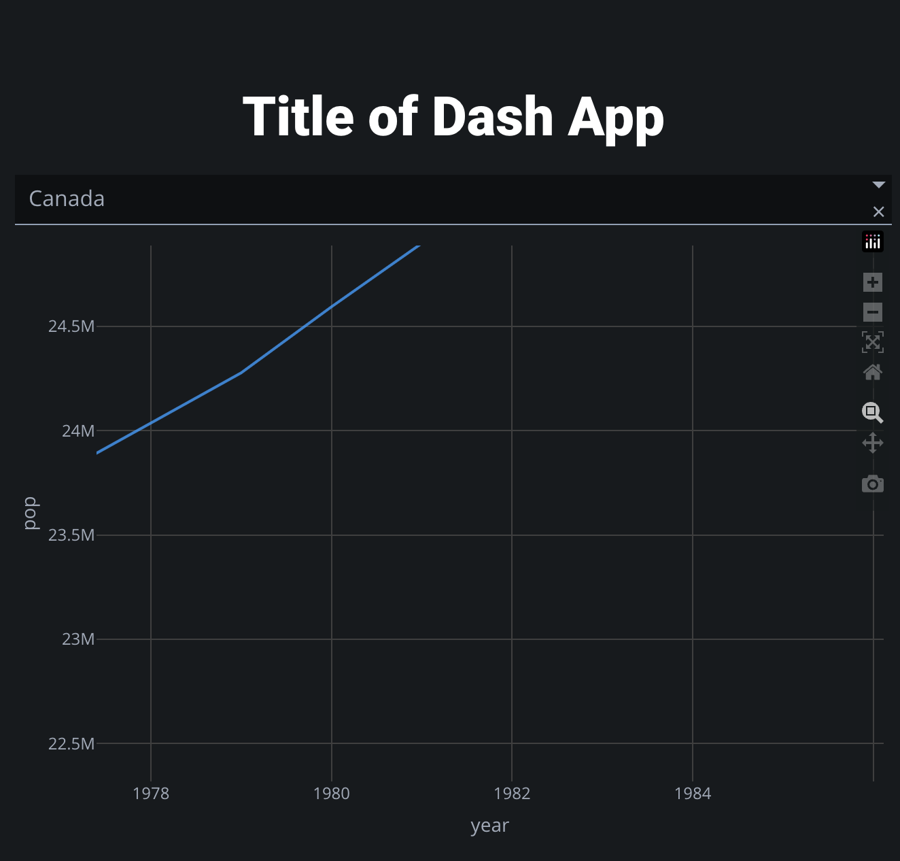

**Dash by Plotly** est un framework open-source pour la création d'applications web interactives avec Python.
`
Il permet aux développeurs de créer des tableaux de bord interactifs et dynamiques en utilisant uniquement du code Python. - Avec Dash, les utilisateurs peuvent créer des applications web avec : 
- des graphiques interactifs
- des tableaux de données
- des widgets
- des composants personnalisés.


A minimal Dash app will typically look like this:

```python

from dash import Dash, html, dcc, callback, Output, Input
import plotly.express as px
import pandas as pd

df = pd.read_csv('https://raw.githubusercontent.com/plotly/datasets/master/gapminder_unfiltered.csv')

app = Dash(__name__)

app.layout = html.Div([
    html.H1(children='Title of Dash App', style={'textAlign':'center'}),
    dcc.Dropdown(df.country.unique(), 'Canada', id='dropdown-selection'),
    dcc.Graph(id='graph-content')
])

@callback(
    Output('graph-content', 'figure'),
    Input('dropdown-selection', 'value')
)
def update_graph(value):
    dff = df[df.country==value]
    return px.line(dff, x='year', y='pop')

if __name__ == '__main__':
    app.run(debug=True)

```

