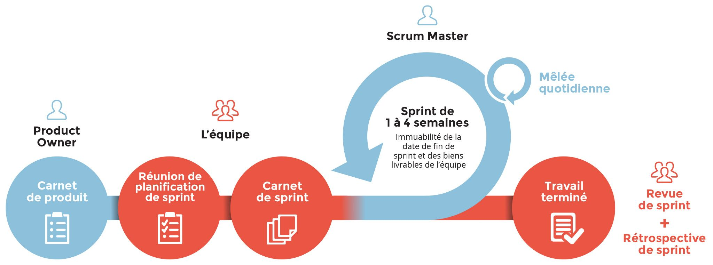

La méthode agile est une **méthode de gestion de projet**. L’idée, lorsque l’on utilise cette approche, est d’apporter souplesse et performance à la gestion de projet. Centrée sur l’humain et la communication, elle **permet aux clients de participer au développement d’un produit** tout au long de l’avancement du projet.

C’est le haut taux d’échec observé dans les projets des années 1990 qui a poussé dix-sept experts en développement logiciel à se réunir aux États-Unis en 2001. Leurs échanges constructifs ont permis l’élaboration du **manifeste agile**. Ce dernier a défini les méthodes agiles jusqu’à aujourd’hui.

Dans cet ouvrage, les auteurs ont notamment mis en avant **quatre valeurs fondatrices** de **la méthode agile** :

- Les individus et leurs interactions plutôt que les processus et [les outils de gestion de projet](https://slack.com/intl/fr-fr/solutions/project-management) ;
- Des logiciels opérationnels plutôt qu’une documentation exhaustive ;
- La collaboration avec les clients plutôt que la négociation contractuelle ;
- L’adaptation au changement plutôt que le suivi d’un plan.
