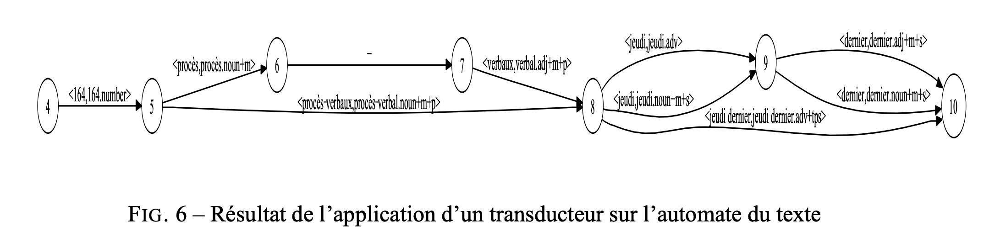

La plate-forme logicielle Outilex, développée par Olivier Blanc, Matthieu Constant et Éric Laporte de l'Université de Marne-la-Vallée, est une solution complète pour le traitement automatique du texte écrit. Voici quelques points clés à retenir :

- **Objectif**: Outilex vise à fournir des outils de traitement de texte aux chercheurs, aux développeurs et à l'industrie pour effectuer diverses opérations dans le domaine du traitement automatique du langage naturel.
    
- **Composants logiciels**: La plate-forme comprend des composants logiciels qui réalisent toutes les opérations fondamentales du traitement automatique du texte, y compris les traitements sans lexiques, l'exploitation de lexiques et de grammaires, et la gestion de ressources linguistiques.
    
- **Formats de données**: Les données manipulées sont structurées dans des formats XML, ainsi que dans d'autres formats plus compacts, lisibles ou binaires selon les besoins. Des convertisseurs de formats sont inclus dans la plate-forme pour faciliter la manipulation des données.
    
- **Intégration de méthodes**: Les formats de grammaires permettent de combiner des méthodes statistiques avec des méthodes basées sur des ressources linguistiques, offrant ainsi une approche plus robuste pour le traitement du langage.
    
- **Lexiques inclus**: La plate-forme distribue des lexiques du français et de l'anglais, provenant du Laboratoire de linguistique formelle (LADL), avec une couverture substantielle. Ces lexiques sont distribués sous licence LGPL-LR.

Lire [article](https://aclanthology.org/2006.jeptalnrecital-long.5.pdf)