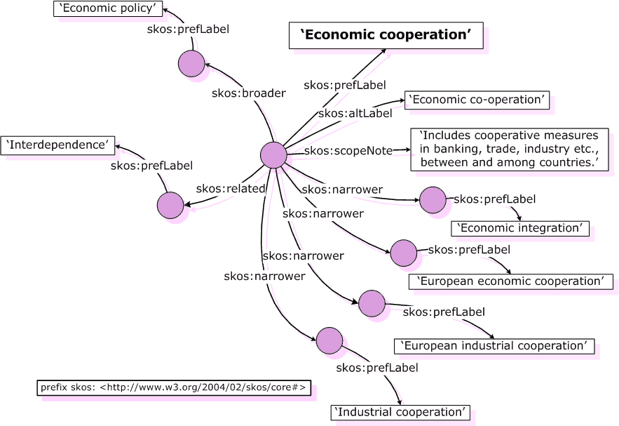

SKOS, acronyme de Simple Knowledge Organization System, est une spécification du W3C conçue pour aider à organiser et à représenter des connaissances dans un format compréhensible par les machines et les humains. En fournissant un vocabulaire contrôlé pour décrire les concepts et les relations entre eux, SKOS facilite la création de systèmes de classification et de taxonomie. Cette spécification est largement utilisée dans les domaines de la gestion de l'information, de la bibliothéconomie et de la recherche sémantique pour structurer et interconnecter des ensembles de données hétérogènes, favorisant ainsi la découverte et l'accès à l'information de manière plus efficace et cohérente.

Exemple : 
