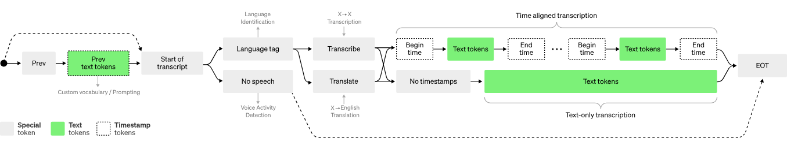

```
We’ve trained and are open-sourcing a neural net called Whisper that approaches human level robustness and accuracy on English speech recognition.
```

OpenAI Whisper est une bibliothèque open source développée par OpenAI pour la génération de texte conversationnel plus naturel et plus persuasif. En utilisant des techniques d'apprentissage automatique de pointe, Whisper vise à améliorer la capacité des modèles de langage à produire un langage plus fluide, plus empathique et plus contextuellement approprié. Cette bibliothèque offre aux développeurs un moyen d'expérimenter avec des modèles de génération de texte améliorés, ce qui peut être particulièrement utile dans des applications telles que la création de chatbots, la rédaction automatique de contenu et l'assistance à la rédaction. Avec sa documentation complète et ses exemples d'utilisation, OpenAI Whisper facilite l'intégration de ces avancées dans les projets de traitement du langage naturel. 



plus d'informations sur OpenAI Whisper [ici](https://openai.com/research/whisper).