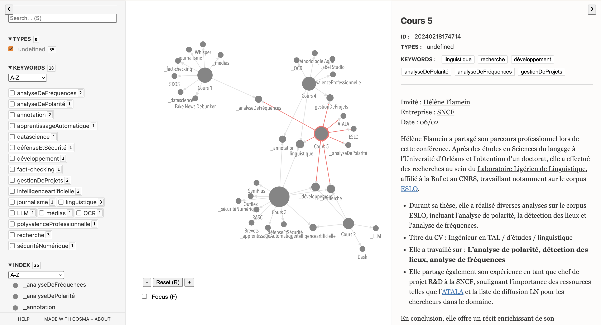

# Projet de synthèse des conférences professionnelles

Ce référentiel est dédié au projet éducatif réalisé à la fin de l'écoute des Conférences Professionnelles à l'université Paris Nanterre, dans le cadre du programme d'études TAL M2.

Il représente un [site web](https://michabiriuchinskii.github.io/Conferences_Prof/#20240218174630) qui rassemble les notes prises lors des conférences, ainsi qu'un graphe montrant les différentes relations entre les conférences.

Il est à noter que le projet original a été initialement réalisé dans l'application Obsidian :


Obsidian est une application populaire de prise de notes en Markdown dans le domaine de la gestion des connaissances personnelles. L'éditeur Obsidian est gratuit mais n'est pas open source. Il dispose de certaines fonctionnalités premium payantes. Obsidian Publish est l'une de ces fonctionnalités premium, qui permet de partager la vue graphique des liens bidirectionnels entre les notes.

De cette façon, dans le but de partager ce graphe, j'ai implémenté le projet [obsidian2cosma](https://github.com/kevinpolisano/obsidian2cosma) qui aide à convertir le format Obsidian en format Cosma pour une visualisation graphique gratuite : 

```terminal
python obsidian2cosma.py -i input_folder_path -o output_folder_path
                       [--type TYPE] [--tags TAGS]
                       [--typedlinks TYPEDLINKS] [--semanticsection SEMANTICSECTION]
                       [--creationdate CREATIONDATE]
                       [--zettlr ZETTLR] 
                       [--verbose]
```

Veuillez noter que sur le [site](https://michabiriuchinskii.github.io/Conferences_Prof/#20240218174630), vous pouvez explorer toutes les fonctionnalités de Cosmo (déplacer des cellules, ouvrir des notes, voir les éléments communs entre les notes, étudier les liens, etc.)



**Profitez-en !**

Réalisé par Mikhail Biriuchinskii
