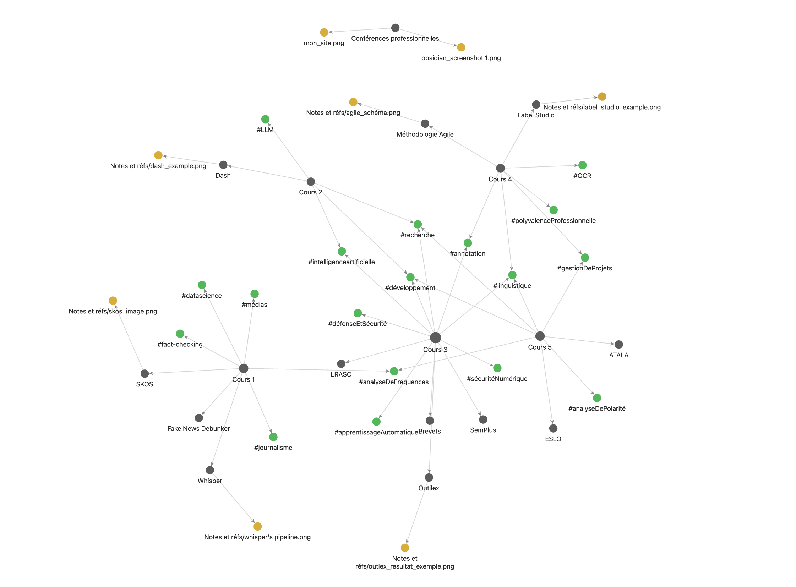

# Conférences professionnelles

Ce référentiel est dédié au projet éducatif réalisé à la fin de l'écoute des Conférences Professionnelles à l'université Paris Nanterre, dans le cadre du programme d'études TAL M2.

Il représente un [site web](https://michabiriuchinskii.github.io/Conferences_Prof/) qui rassemble les notes prises lors des conférences, ainsi qu'un graphe montrant les différentes relations entre les conférences.

Il est à noter que le projet original a été initialement réalisé dans l'application Obsidian :

Obsidian est une application populaire de prise de notes en Markdown dans le domaine de la gestion des connaissances personnelles (PKM), avec un soutien important de la communauté et de nombreux plugins open source tiers. L'éditeur Obsidian est gratuit mais n'est pas open source. Il dispose de certaines fonctionnalités premium, comme la synchronisation et la publication des notes en ligne. Obsidian Publish est l'une de ces fonctionnalités premium, qui permet de partager l'incroyable vue graphique des liens (bidirectionnels) entre les notes.

Cependant, dans le but de publier ce graphe, j'ai utilisé le projet [obsidian2cosma](<https://github.com/kevinpolisano/obsidian2cosma](https://github.com/kevinpolisano/obsidian2cosma)>) qui aide à convertir le format Obsidian en format Cosma pour une visualisation graphique gratuite : 

Veuillez noter que sur le [site](https://michabiriuchinskii.github.io/Conferences_Prof/), vous pouvez explorer toutes les fonctionnalités de Cosmo (déplacer des cellules, ouvrir des notes, voir les éléments communs entre les notes, etc.)

**Profitez-en !**

Réalisé par Mikhail Biriuchinskii
